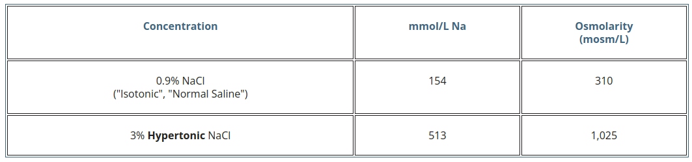

title:: NaCl 3%
alias:: Sódio hipertónico

- como preparar 1L de NaCl 3%
	- material necessário
		- 1L SF
		- 5 ampolas de NaCl 20% de 20 mL
	- instruções
		- retirar 100 mL do SF 1L
		- adicionar as 5 ampolas de [[NaCl 20%]] de 20 ml (100 mL total) aos 900 mL de SF
	- maneira rápida de preparar 560 mL
		- 3 amp NaCl 20% (60 mL) + 500 mL de SF
			- tem 0.5 meq de na por ml
- ### imagens
	- comparação entre SF e NaCl 3%
		- 
		- REF https://www.lhsc.on.ca/nicu/3-hypertonic-sodium-chloride-nacl
-