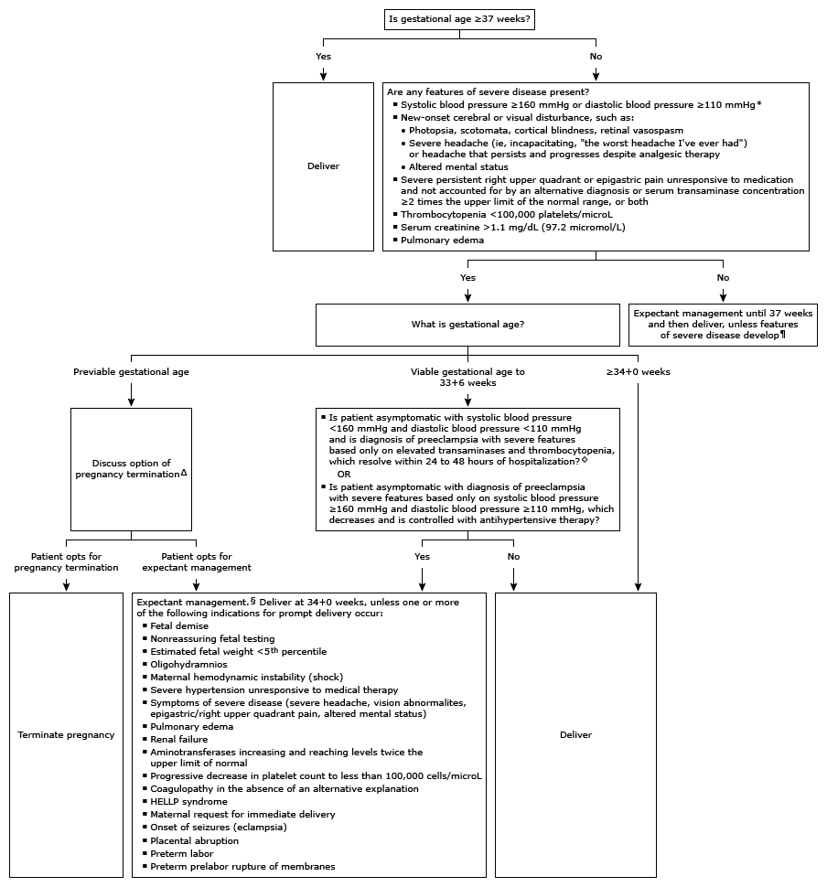
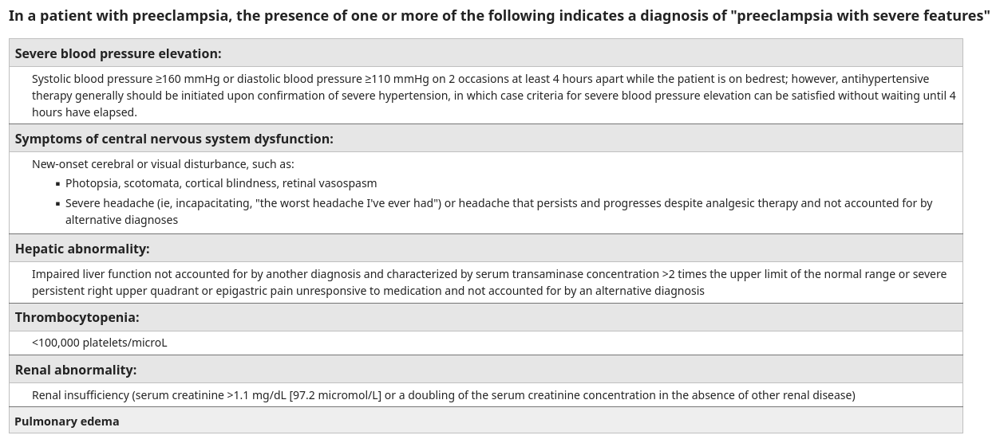

- # timing of delivery
	- #delivery depende de
		- tempo gestacional
		- severidade da preeclampsia
		- condição materna
		- condição fetal
	- 
	- ## preeclampsia severa
	  id:: 629f6dce-18f4-4a92-8d3c-930c26911a25
		- preeclampsia com caracteristicas de severidade é geralmente indicação para parto, independentemente da idade gestacional
			- pelo alto risco de morbilidade materna
			- 
			-
	-